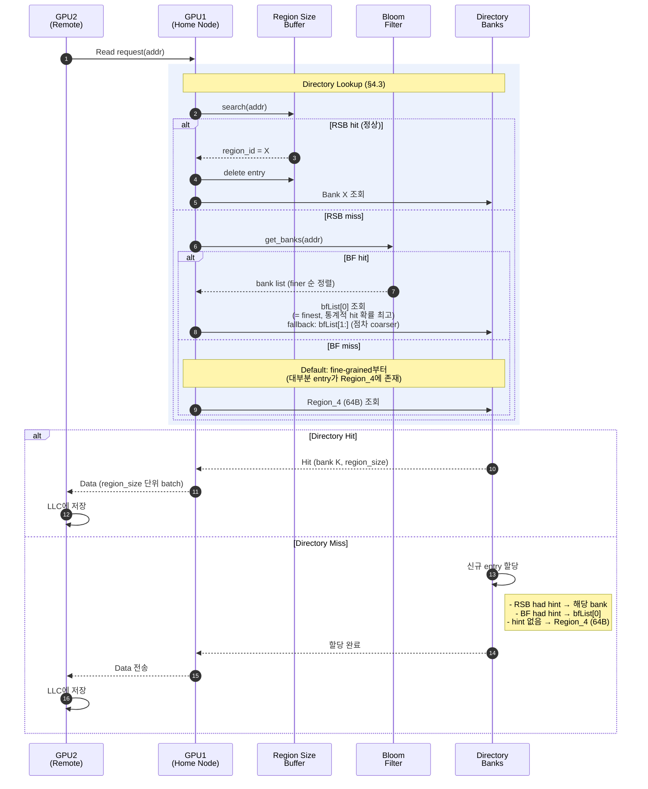
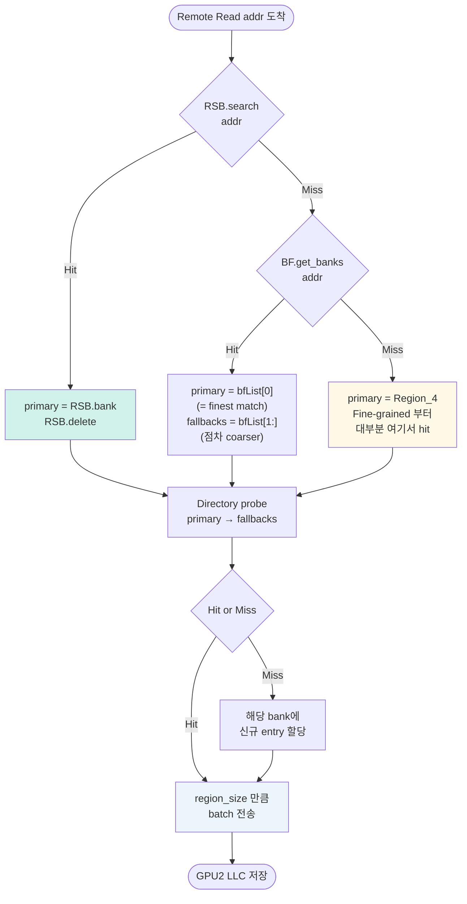
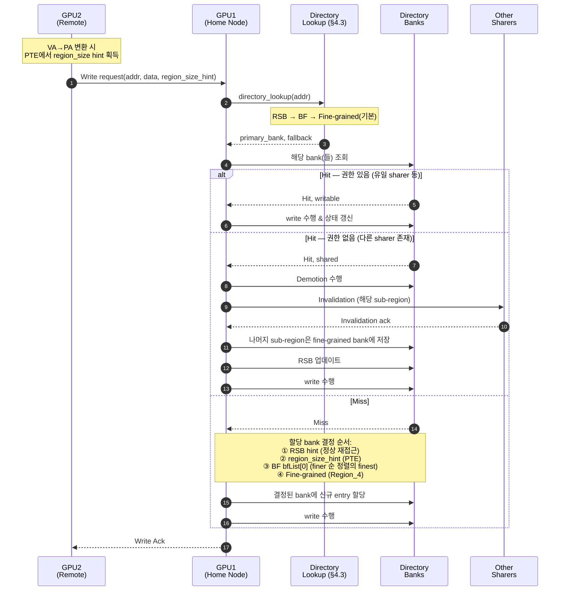

# Adaptive Region-Size Directory Design

> Multi-GPU 시스템의 캐시 일관성(Cache Coherence)을 위한 **가변 크기 Region 기반 Directory** 구조 설계 문서

---

## 📑 목차

1. [설계 목표 및 핵심 아이디어](#1-설계-목표-및-핵심-아이디어)
2. [전체 아키텍처 개요](#2-전체-아키텍처-개요)
3. [Directory 구조 상세](#3-directory-구조-상세)
4. [보조 구조 (Auxiliary Structures)](#4-보조-구조-auxiliary-structures)
5. [동작 프로토콜](#5-동작-프로토콜)
6. [시나리오별 동작 흐름](#6-시나리오별-동작-흐름)
7. [Edge Case 및 설계 고려사항](#7-edge-case-및-설계-고려사항)
8. [하드웨어 오버헤드 분석](#8-하드웨어-오버헤드-분석)

---

## 1. 설계 목표 및 핵심 아이디어

### 🎯 설계 목표

| # | Goal | 해결 대상 Observation |
|---|------|----------------------|
| G1 | **Dynamic Adaptation** – 접근 패턴에 따라 coherence 관리 단위를 런타임에 조절 | Optimum coherence unit size |
| G2 | **Metadata Efficiency** – 공간적 상관관계를 활용하여 중복된 메타데이터 제거 | Metadata redundancy |
| G3 | **Capacity Extension** – 동일 하드웨어 용량으로 더 넓은 L2 영역 커버 | Directory capacity limitation |
| G4 | **Low Overhead** – Lookup latency 및 하드웨어 비용 최소화 | 실용성 확보 |

### 💡 핵심 아이디어

> **하나의 고정된 단위가 아닌, 여러 크기의 region bank를 두고 데이터 공유 패턴에 따라 동적으로 promotion/demotion한다.**

- 기존: 모든 data를 **cacheline(64B) 단위**로만 관리
- 제안: **64B ~ 16KB**의 5개 bank로 구성, 공유 패턴에 맞는 크기로 **승격(Promotion)/강등(Demotion)**

---

## 2. 전체 아키텍처 개요

### 2.1 System-Level View

```
┌─────────────────────────────────────────────────────────────┐
│                       GPU (Home Node)                        │
│                                                              │
│   ┌──────────┐    ┌──────────────────────────────────────┐  │
│   │          │    │    Adaptive Region-Size Directory    │  │
│   │   L2     │    │  ┌──────────────────────────────┐    │  │
│   │  Cache   │◄──►│  │ Region_0 Bank    (16KB unit) │    │  │
│   │          │    │  ├──────────────────────────────┤    │  │
│   │          │    │  │ Region_1 Bank    (4KB  unit) │    │  │
│   │          │    │  ├──────────────────────────────┤    │  │
│   │          │    │  │ Region_2 Bank    (1KB  unit) │    │  │
│   │          │    │  ├──────────────────────────────┤    │  │
│   │          │    │  │ Region_3 Bank    (256B unit) │    │  │
│   │          │    │  ├──────────────────────────────┤    │  │
│   │          │    │  │ Region_4 Bank    (64B  unit) │    │  │
│   │          │    │  └──────────────────────────────┘    │  │
│   │          │    │                                       │  │
│   │          │    │  ┌───────────────┐  ┌─────────────┐  │  │
│   │          │    │  │ Bloom Filter  │  │ RS Buffer   │  │  │
│   │          │    │  └───────────────┘  └─────────────┘  │  │
│   └──────────┘    └──────────────────────────────────────┘  │
│                                                              │
└─────────────────────────────────────────────────────────────┘
            ▲                                      ▲
            │                                      │
            └──────── NVLink / Interconnect ───────┘
                         (Remote GPU들과 통신)
```

### 2.2 구성 요소 요약

| 구성 요소 | 역할 |
|-----------|------|
| **5 Region Banks** | 서로 다른 granularity (`s_k` / `c_k`) 단위로 coherence 관리 |
| **Bloom Filter** | 각 bank에 entry가 존재하는지 빠르게 판단 |
| **Region Size Buffer** | Eviction된 region의 과거 크기 정보 기억 |
| **Region-aware MSHR** | Region 단위 주소 매칭 지원 |

---

## 3. Directory 구조 상세

### 3.1 Bank Granularity 설계

모든 bank는 **1 entry = 4 × sub-entry** 구조를 공유한다 (uniform 4-way sub-entry law).

- **`s_k`**: bank *k* 의 sub-entry size — sharer tracking 의 최소 단위.
- **`c_k = 4 × s_k`**: 1 entry 가 커버하는 주소 범위.

| k | Bank | `s_k` | `c_k` | Alignment | 특이점 |
|---|------|---|---|---|---|
| 0 | Region_0 | 16 KB | 64 KB | 64KB | `c_0` = 1 page (PA 변환 안전 경계) |
| 1 | Region_1 | 4 KB  | 16 KB | 16KB | — |
| 2 | Region_2 | 1 KB  | 4 KB  | 4KB  | — |
| 3 | Region_3 | 256 B | 1 KB  | 1KB  | REC 의 1KB-range 와 동일 coverage |
| 4 | Region_4 | 64 B  | **256 B** | 256B | HMG (4-CL = 256B) 와 iso-coverage |

**경계 정당화:**
- Lower bound `s_4 = 64B = DefaultBlockSizeBytes`. 이보다 작은 sub-entry 는 MGPUSim
  coherence event 로 구분 불가 → 정보량 0.
- Upper bound `c_0 = 64KB = PageSize`. Entry 가 page 를 넘으면 VA→PA 가 단일 entry 내
  비연속이 되어 base address 단일화 가정이 깨진다.

> **Design Invariant V8 (신설):**
> `∀k: c_k = 4×s_k` ∧ `s_4 = DefaultBlockSizeBytes` ∧ `c_0 ≤ PageSize`.
> 이 3개 제약이 bank 개수(5), 비율(4×), 경계값을 **일의적으로 결정**한다.

> **용어 주의:** 과거 서술의 "region-size" 라는 표현은 **sub-entry granularity** 를
> 뜻하는 경우와 **entry coverage granularity** 를 뜻하는 경우가 혼재했다. 본 문서
> 이후로는 모든 설계 단정이 `s_k` (sub-entry granularity) 또는 `c_k` (entry coverage
> granularity) 를 명시적으로 구분한다. 2026-04-20 사용자 확정 (interpretation β) 에
> 따라 위 표가 유일한 정의이며, "region-size" 라는 단일 단어는 더 이상 설계 약속이
> 아니다.

### 3.2 Bank 구조

각 bank는 해당 granularity (`c_k`) 에 맞는 directory entry 를 저장한다.

#### Bank 공통 구조

하나의 entry는 다음 구조를 가짐:

```
┌────────────────────────────────────────────────────────────┐
│                  Directory Entry                            │
├────────────────┬───────────────────────────────────────────┤
│  Base Address  │  Sub-Entries (공통 base를 공유)            │
│   (공통)       │  ┌──────────┬──────────┬─────┬──────────┐  │
│                │  │ SubEntry │ SubEntry │ ... │ SubEntry │  │
│                │  │ Sharer 1 │ Sharer 2 │     │ Sharer 4 │  │
│                │  └──────────┴──────────┴─────┴──────────┘  │
└────────────────┴───────────────────────────────────────────┘
```

- **Base Address**: Entry가 커버하는 메모리 영역의 시작 주소 (공통)
- **Sub-Entries**: 각 sub region의 **독립적인 sharer 정보**
- **핵심**: 공통 base를 하나만 저장하므로 메타데이터 중복 감소

#### Bank별 세부 구조

| Bank | `s_k` | `c_k` | Entry 구성 | 대조군과의 관계 |
|------|-------|-------|-----------|----------------|
| Region_0 | 16KB | 64KB | 공통 base (48b) + 4× 16KB sub-entry | 1 entry = 1 page |
| Region_1 | 4KB  | 16KB | 공통 base + 4× 4KB sub-entry  | — |
| Region_2 | 1KB  | 4KB  | 공통 base + 4× 1KB sub-entry  | — |
| Region_3 | 256B | 1KB  | 공통 base + 4× 256B sub-entry | REC 1KB 와 iso-coverage |
| Region_4 | 64B  | **256B** | 공통 base + 4× 64B sub-entry  | **HMG 4-CL 과 iso-coverage** |

> **⚠️ Reviewer 방어 callout**
>
> **R-Q1**: "Region_4 = 64B 아니었나?"
> → `s_4 = 64B` (sharer tracking granularity), `c_4 = 256B` (entry coverage). 둘이 다르다.
>
> **R-Q3**: "HMG 4-CL 과 뭐가 다른가?"
> → Iso-coverage(256B), iso-entry-count 조건에서 HMG 는 1 sharer set, Superdirectory 는
> 4 독립 sharer set. 차이는 false invalidation 유무.
>
> **R-Q4**: "Baseline 64B-cacheline directory 는?"
> → Baseline 8K entry × 64B = 512KB coverage.
> Superdirectory Region_4 8K entry × 256B = 2MB coverage (= 4× 확장).
> 해상도(64B) 는 동일, metadata 당 coverage 만 4× 확대.

> **설계 의도**: 현재 bank 에서 4개 sub-entry 의 sharer 가 모두 동일해지면 한 단계
> coarse-grained bank 로 promotion 가능. 상세 정책은 §3.3 참조.

### 3.3 Entry 할당 / 승격 / 강등 정책

#### 3.3.1 최초 할당
- 모든 entry 는 **Region_4 (`s_4 = 64B`, `c_4 = 256B`)** 에서 시작.
- 접근된 cache line 에 대응하는 **1 sub-entry 에만 sharer 기록**, 나머지 3 sub-entry 는
  invalid (sharer = ∅).
- 예외: RSB 혹은 페이지 테이블 힌트가 있을 경우 상위 bank 에 직접 할당 (§4.1).

#### 3.3.2 Promotion (승격) — *읽기 X, 사용자 확정 2026-04-20*

**조건:** Bank *k* 의 1 entry 내 4 sub-entry 가 **모두 valid 이고 sharer set 이 동일**할 때.

**동작:**
```
1. Bank k-1 에서 해당 주소를 cover 하는 entry `E_up` 를 lookup.
   ├─ E_up 이 존재 (= 이미 다른 sub-entry 가 채워진 상태):
   │    대응 1 sub-entry slot 에 sharer 복사 (allocation-if-absent)
   └─ E_up 이 없음 (신규):
        Bank k-1 에 entry 신규 할당, 대응 sub-entry 에만 sharer 기록,
        나머지 3 sub-entry 는 invalid 로 남김. [design decision X-a]

2. Bank k 의 해당 **1 entry 내 4 sub-entries 를 invalid 처리**.
   Entry slot 자체도 free (재사용 가능).

3. BF/RSB 갱신 (§4.2, §4.3).
```

> **Reviewer 방어 R-Q5 (promotion on non-existing Bank k-1 entry):**
> 신규 Bank k-1 entry 를 즉시 할당하는 방식(X-a) 을 채택. 이유: 연속된 다음 접근이 같은
> `c_{k-1}` 범위에 올 확률이 높으며 (spatial locality 가정), 이 때 deferred allocation
> 은 중복 lookup 낭비. X-b (deferred) 대안은 A9 ablation 대상으로만 남겨둔다.
> 본 결정은 **design default, validated by micro-scenario test** 이며 추측이 아니다.

#### 3.3.3 Demotion (강등) — *해석 R, 사용자 확정 2026-04-20*

**발동 시점:** Bank *k* entry 의 eviction 혹은 partial invalidation 종료 시점.

**기준량:** `valid_count(E) = |{i : E.sub_entry[i].sharer ≠ ∅}|`, `∈ {0, 1, 2, 3, 4}`.

**조건:** `valid_count(E) < T_demote × 4`, 여기서 `T_demote ∈ {1/4, 2/4, 3/4, 4/4}`.
(예시: `T_demote = 3/4` → `valid_count < 3` 일 때 demote)

| `T_demote` | 풀이 | 의미 |
|------------|------|------|
| 4/4 | `valid_count < 4` 일 때 demote | 1개라도 비면 강등 (가장 aggressive) |
| 3/4 | `valid_count < 3` 일 때 demote | 절반 이하 사용 시 강등 |
| 2/4 | `valid_count < 2` 일 때 demote | 1개만 사용 중이면 강등 |
| 1/4 | `valid_count < 1` 일 때 demote | 전부 비어야 강등 (= free only; 실질 demote 없음) |

**동작 (`T_demote` 조건 충족 시):**
```
1. 유효한 (sharer ≠ ∅) sub-entry 각각을 Bank k+1 로 "재삽입"
   - Bank k+1 에서 해당 주소 cover 하는 entry 를 lookup/allocate
   - sub-entry 1개에 sharer 복사 (Promotion 역방향과 대칭)
2. Bank k entry 완전 free.
3. RSB 갱신 (§4.2): 원래 bank ID = k 로 기록 (재진입 시 직행용).
```

> **🛑 design 확정 사항:**
> `T_demote` 는 설계 파라미터 (ablation A8 sweep 대상). 설계 단계에서 hardcoded 하지
> 않는다. 과거 서술에 존재하던 8분수 표기(예: "max의 N/8 미만") 는 예시 역할로
> 작성된 것이었으나 **β / 해석 R 하에서 4-way sub-entry 와 정의 불가 비율**이므로
> 전 문서에서 삭제한다.
> 본 문서의 `T_demote = 3/4` 예시는 서술용 예이며, 실험에서의 선택값은 §A8 ablation
> 완료 후 보고한다.

#### 3.3.4 Write-Invalidation 으로 인한 비-typical demotion

Remote write 발생 시 해당 sub-entry 의 sharer 를 업데이트하되, 다른 sub-entry 는 유지.
Invalidation 처리 종료 후 `valid_count` 를 재평가하여 §3.3.3 조건에 해당되면 demote.

---

## 4. 보조 구조 (Auxiliary Structures)

> **용어 정리** (이 문서 전체에서 통일)
> - **Coarse-grained region** = 작은 Bank ID = 큰 granularity (예: Region_0 `s_0=16KB, c_0=64KB`)
> - **Fine-grained region** = 큰 Bank ID = 작은 granularity (예: Region_4 `s_4=64B, c_4=256B`)
> - Lookup 시 hint가 없으면 **fine-grained region(Region_4, 64B)부터 확인**하는 것이 기본 정책
>   → 모든 entry는 최초 fine-grained bank에 할당되므로 대부분의 경우 1회 접근으로 hit 가능

### 4.1 Region Size Buffer (RSB) — *Lookup 최우선 hint*

Eviction/Invalidation된 region의 **직전 bank 정보를 기억**하는 구조.
Directory lookup 시 **가장 먼저 조회되는 hint**로 사용됨.

#### 용도
- Entry가 eviction/invalidation될 때 해당 region이 어느 bank에 있었는지 기록
- 재요청 시, fine-grained bank부터 시작해서 promotion이 다시 일어나기를 기다리는 과정 없이  
  **RSB에 기록된 bank로 직접 할당/lookup**
- 공간적 locality가 시간 축으로도 유지된다는 관찰을 활용

#### 저장 정보
```
┌──────────────┬──────────────────┐
│  Base Addr   │  Region ID (=bank)│
└──────────────┴──────────────────┘
```

#### 🔑 RSB 사용 원칙 (Primary Flow)
1. Lookup/Allocation 시 RSB를 **먼저 조회**
2. RSB hit → **기록된 bank에서 직접 처리**
3. 처리 후 **RSB entry는 즉시 삭제** (consume-on-use)

#### 🛡️ Staleness 방어 (예외 처리)
드물게 RSB entry가 남아있는 상태에서 해당 region이 다른 경로로 coarser bank에 재등장했다면 RSB는 stale 상태가 됨.  
이를 감지하기 위해 RSB hit 시 **BF에 더 coarser한 bank가 있는지 간단히 확인**하는 방어 로직이 존재 (§4.3 참조).  
→ 이 경로는 정상 흐름이 아니며, 드문 race 상황을 위한 안전장치임.

### 4.2 Bloom Filter (BF) — *Lookup 보조 hint*

각 bank에 어떤 entry가 들어 있는지 빠르게 판단하기 위한 구조.
RSB miss 시 fallback hint로 사용되고, RSB hit 시에는 staleness 방어용으로 사용됨.

#### 구조
- **5개 counter**로 구성 (각 bank에 대해 1개씩)
- Counter 크기는 bank의 directory entry 용량에 비례하여 설계
- 각 bank를 커버하는 address 범위에 대해 membership 추적

#### 반환 값
- `GetBank(addr)` → **해당 주소를 포함할 가능성이 있는 bank ID 리스트** (**finer 순으로 정렬**)
- `bfList[0]` = 가장 **fine-grained**한 bank (가장 먼저 조회해야 할 bank)
- 리스트가 비어 있으면 어느 bank에도 해당 주소가 없음

> **정렬 방향의 근거**: 모든 entry는 최초에 fine-grained bank(Region_4)에 할당되고, promotion 조건(4 sub-entry sharer 일치)이 충족되어야만 coarser bank로 이동한다. 통계적으로 **대부분의 hit은 fine-grained bank에서 발생**하므로 해당 bank를 가장 먼저 탐색해야 평균 lookup latency가 최소화됨.

#### 특별 규칙
- Counter 최대값 도달 시, **eviction 시에도 감소시키지 않음** (false negative 방지)
- 최대값 도달 이후에는 보수적으로 true 유지 → 기능 안정성 확보

### 4.3 Directory Lookup 알고리즘

RSB와 BF를 조합하여 최소한의 bank 접근으로 lookup을 수행하는 알고리즘.

#### 우선순위 & Lookup 순서
1. **RSB** (과거 경험 기반 정확한 hint) → 사용 후 삭제
2. **BF** (현재 상태 기반 hint, RSB miss 시 사용)
   - bfList는 **finer 순으로 정렬**되어 있으므로 **bfList[0] (finest)부터 확인**
3. **Default = fine-grained bank (Region_4, 64B)** (hint 없을 때 fallback)

> **왜 finer bank부터 확인하는가?**  
> 모든 entry는 fine-grained bank에서 시작하며, promotion 조건을 만족해야만 coarser bank로 이동한다. 따라서 통계적으로 hit의 대다수는 fine-grained bank에서 발생 → 해당 bank를 가장 먼저 probe하는 것이 평균 lookup latency를 최소화함.

#### Primary Flow (정상 경로)

```
┌─────────────────────────────────────────────────┐
│ 1. RSB.search(addr)                              │
│                                                  │
│    ├─ RSB Hit ───► ✅ Use RSB.region_id          │
│    │               → allocate/lookup             │
│    │               → RSB.delete (consume)        │
│    │                                             │
│    └─ RSB Miss ──► 2. BF.get_banks(addr)         │
│                       (finer 순 정렬 리스트)      │
│                                                  │
│                    ├─ BF Hit ──► Use bfList[0]   │
│                    │              (= finest match)│
│                    │              → fallback:    │
│                    │                bfList[1:]   │
│                    │                (점차 coarser)│
│                    │                             │
│                    └─ BF Miss─► Use Fine-        │
│                                 grained bank     │
│                                 (Region_4, 64B)  │
└─────────────────────────────────────────────────┘
```

#### 의사 코드

```python
def directory_lookup(addr):
    rsb_entry = RSB.search(addr)
    
    if rsb_entry.valid:
        # === Primary Flow: RSB hit ===
        # RSB에 기록된 bank에서 직접 처리, 사용 후 삭제
        primary_bank   = rsb_entry.region_id
        fallback_banks = []
        
        # 🛡️ Staleness 방어 (드문 race 상황 대비)
        # bfList는 finer 순 정렬 → 가장 coarse-grained한 bfList[-1]이
        # RSB보다 coarser면 promotion이 RSB 생성 이후 발생했다는 의미
        bf_list = BF.get_banks(addr)
        if len(bf_list) > 0 and bf_list[-1] < rsb_entry.region_id:
            primary_bank   = bf_list[-1]           # 가장 coarser bank로 교체
            fallback_banks = reversed(bf_list[:-1]) # 나머지, coarser부터
        
        RSB.delete(rsb_entry)  # 사용 후 소비 (항상)
    
    else:
        # === RSB miss: BF fallback ===
        bf_list = BF.get_banks(addr)  # finer 순 정렬
        if len(bf_list) > 0:
            primary_bank   = bf_list[0]    # finest부터 확인
            fallback_banks = bf_list[1:]   # 점차 coarser 순
        else:
            # hint 전무 → fine-grained bank부터 확인
            primary_bank   = FINEST_BANK   # Region_4 = 64B
            fallback_banks = []
    
    return primary_bank, fallback_banks
```

#### 동작 정리

| 상황 | Primary Bank | Fallback | RSB 처리 | 빈도 |
|------|--------------|----------|---------|------|
| **RSB hit** (정상) | RSB.region_id | 없음 | 삭제 (consumed) | 🟢 흔함 |
| **RSB hit + stale** (BF에 더 coarser 존재) | BF 최하단(coarsest) | BF 나머지 | 삭제 (stale) | 🔴 드묾 (방어 로직) |
| **RSB miss + BF hit** | `bfList[0]` (finest) | `bfList[1:]` (점차 coarser) | — | 🟡 보통 |
| **RSB miss + BF miss** | **Fine-grained bank (Region_4 = 64B)** | 없음 | — | 🟢 흔함 (초기 진입) |

#### 예시 시나리오 (정상 경로)

```
시점 T0: Region A는 Bank 3 (s_3=256B, c_3=1KB)에 존재
시점 T1: Bank 3에서 eviction 발생
         → valid_count(E) ≥ T_demote × 4 확인 (demote 조건 미충족)
         → RSB에 {addr_A, region_id=3} 저장
시점 T2: Region A에 재접근
         → RSB.search(addr_A) → hit, region_id=3
         → Bank 3에 바로 entry 할당 (fine-grained bank 거치지 않음)
         → RSB.delete (consumed)
         → ✅ 정상 종료
```

> **의미**: RSB 덕분에 fine-grained bank부터 다시 promotion을 누적하는 비효율을 건너뛸 수 있음.  
> RSB miss 시에도 대부분의 entry는 fine-grained bank에 있으므로, 해당 bank를 먼저 lookup하면 1회 접근으로 hit하는 경우가 대부분임.

### 4.4 Region-aware MSHR

#### 수정 사항
- 기존 MSHR entry에 **region length 정보 필드 추가**
- Cache address 비교를 **masking 기반**으로 수행
  - 예: entry coverage granularity (`c_k`) 가 1KB면 하위 10비트를 mask하여 동일 entry 판정

#### 효과
- Region 단위 merge 요청 처리 가능
- Promotion/Demotion 진행 중 발생하는 중복 요청 처리
- 서로 다른 granularity의 요청이라도 같은 region이면 merge 가능

#### 🏗️ Shared vs Independent MSHR (설계 결정)

**결론: Shared(통합) MSHR + region_size 필드 방식 채택**

| 기준 | Shared MSHR ✅ | Independent MSHR (per-bank) |
|------|----------------|------------------------------|
| Promotion/Demotion 처리 | region_size 필드만 갱신 | Bank 간 entry 이관 필요 |
| Race condition 해결 | Single source of truth | Bank 간 동기화 필요 |
| Masking 비교 | 통일된 로직 | Bank별 고정 마스크만 |
| 자원 활용 | Hot 영역이 pool 공유 | Bank별 불균형 발생 |
| Merge 기회 | 서로 다른 granularity 요청도 merge | Bank 간 merge 불가 |
| 하드웨어 면적 | 단일 구조체 | 5개 + 조정 로직 |
| Contention | 단일 접근점 | Bank 독립 접근 |

**Shared MSHR 채택 이유**:
1. **Promotion/Demotion 진행 중 주소 이동이 잦음** → entry 이관 비용 회피
2. **design.txt가 masking 비교를 명시** → 통합 구조와 자연스럽게 부합
3. **Promotion/Demotion 중 race condition 처리**가 단일 MSHR에서 훨씬 단순
4. **Hot 영역의 miss가 특정 bank에 집중** → 공유 pool이 자원 효율 높음

**Contention 완화 대책** (필요 시):
- **Address-banked MSHR**: address hash로 여러 sub-MSHR로 분산 (directory bank와는 독립)
- Read/Write MSHR 분리

---

## 5. 동작 프로토콜

### 5.1 Promotion (Coarse-grained bank 로 승격)

```
트리거: Bank k 의 1 entry 내 4 sub-entry 의 sharer 가 모두 동일해짐
```

#### 절차 (§3.3.2 참조)
1. Bank *k* 의 1 entry 에서 4 sub-entry sharer 일치 감지
2. Bank *k-1* 의 대응 entry `E_up` lookup — 없으면 신규 할당 (design decision X-a),
   있으면 대응 sub-entry slot 에 sharer 복사 (allocation-if-absent)
3. Bank *k* 의 **해당 1 entry 내 4 sub-entries 를 invalid 처리** (entry slot 도 free)
4. BF counter 갱신 (Bank *k* 감소, Bank *k-1* 증가)

### 5.2 Demotion (Fine-grained bank 로 강등)

```
트리거: Eviction 혹은 partial invalidation 종료 시점,
        valid_count(E) < T_demote × 4  (T_demote ∈ {1/4, 2/4, 3/4, 4/4}; §A8 sweep)
```

#### 절차 (§3.3.3 참조)
1. (선행) partial invalidation 이 원인인 경우: Invalidation ack 수신 후 `valid_count(E)` 재측정
2. 분기 처리:
   - **조건 미충족** (`valid_count(E) ≥ T_demote × 4`): Bank *k* 에 그대로 유지, RSB 에 `bank_id = k` 기록
   - **조건 충족** (`valid_count(E) < T_demote × 4`): 유효 sub-entry 각각을 Bank *k+1* 로 재삽입
     (Promotion 의 역방향과 대칭), Bank *k* entry 를 free, RSB 에 `bank_id = k` 기록 (재진입 시 직행)

### 5.3 Write 에 의한 Demotion

Remote write 로 특정 sub-region 의 sharer 가 축소될 경우:
1. 해당 sub-entry 의 sharer 를 업데이트 (write-invalidate)
2. `valid_count(E)` 를 재평가 — §5.2 조건에 해당되면 demote 경로 진입
3. RSB 갱신

---

## 6. 시나리오별 동작 흐름

### 6.1 Scenario: Remote Read

GPU2가 GPU1(Home)에 있는 data를 읽는 경우.

#### 🔄 전체 Sequence



#### 🧭 Directory Lookup 의사결정 흐름



#### 🔑 핵심 포인트

| 상황 | 처리 |
|------|------|
| **Lookup 우선순위** | RSB (과거 경험) → BF (현재 상태) → **Fine-grained bank (기본값)** |
| **BF 결과 순서** | `GetBank`는 **finer 순으로 정렬**된 리스트 반환 → `bfList[0] = finest` |
| **Finer first 이유** | 모든 entry는 Region_4에서 시작, promotion 조건 달성 시에만 coarser로 이동 → **통계적으로 대부분의 hit이 fine-grained bank에서 발생** |
| **RSB Hit (정상 경로)** | 해당 bank에 직접 접근/할당, RSB entry 즉시 소비 (consume-on-use) |
| **Hit 응답** | 해당 bank granularity `c_k` 전체를 batch 전송 → 네트워크 효율 증대 |
| **Miss 할당 위치** | RSB hint → 해당 bank / BF hint → `bfList[0]`(finest) / hint 없음 → **Region_4 (64B)** 에 보수적 할당 |
| **재접근 시 효율** | RSB가 과거 bank를 직접 지정 → fine-grained부터 promotion 반복 회피 |

### 6.2 Scenario: Remote Write

GPU2가 GPU1(Home)에 있는 data에 쓰는 경우.

#### 🔄 전체 Sequence



#### 🔑 핵심 포인트

| 상황 | 처리 방식 |
|------|----------|
| **Hit + 권한 있음** | 즉시 write, state만 갱신 |
| **Hit + 권한 없음** | Demotion + partial invalidation → 나머지 sub-region은 fine-grained bank로 이동 |
| **Miss** | RSB / PTE hint / BF / fine-grained 순으로 할당 bank 결정 |
| **Write-evict 옵션** | Read/Write 동시성이 낮다면 write-through + evict로 단순화 가능 (§설계 질문) |

> **📝 설계 질문**: Read/Write가 동시에 발생하는 빈도가 낮다면, remote cache를 **write-evict**처럼 동작시켜 설계를 단순화할 수 있음. → **실험으로 검증 필요**

### 6.3 Scenario: Burst Remote Read

인접한 영역에 대한 다수 read가 짧은 시간에 발생하는 경우.

#### 현재 설계 아이디어
- 연속된 요청을 **batching**하여 하나의 region-size 응답으로 처리
- 이상적으로는 MSHR에서 merge하여 단일 응답 생성
- **TODO**: batching 정책의 구체화 필요 (timeout, size threshold 등)

---

## 7. Edge Case 및 설계 고려사항

### 7.1 Race Condition — Promotion 중 Request 도착

**문제**: Entry가 coarse-grained bank로 이동하는 중에 해당 영역에 대한 request가 도착하면?

**해결 방안**:
- MSHR에 해당 요청 기록
- Promotion 완료 후 MSHR을 통해 응답 처리
- MSHR 에 granularity (`c_k`) 필드가 있어 masking 비교로 올바른 entry 매칭 가능

### 7.2 Race Condition — Demotion 중 Request 도착

**문제**: Entry가 fine-grained bank로 이동하는 중에 해당 영역에 대한 request가 도착하면?

**해결 방안**: Promotion과 동일하게 MSHR로 추적
- Invalidation ack까지 완료되지 않은 시점에 요청 도착 가능
- MSHR에 대기시킨 후 demotion 완료 후 재처리

### 7.3 Cache Block보다 큰 단위로 Coherence 관리 시 문제

Coherence 관리 단위 > cache block일 때 발생 가능한 이슈:
- **Partial write**: region 내 일부 cacheline만 수정
- **Partial invalidation**: region 내 일부만 무효화 필요

**해결 방안**:
- Sub-entry 구조가 이 문제를 대부분 흡수
- 각 sub-entry는 독립적인 sharer 관리 → 정밀한 invalidation 가능
- 발생 빈도/영향이 **negligible**함을 보일 필요 있음 (motivation 섹션에 간단히 언급)

### 7.4 Bank Lookup Latency

**문제**: Serial lookup은 최악의 경우 5번의 bank 접근 필요

**완화**:
- **RSB hit**: 해당 bank 1곳만 확인 (`fallback_banks = []`) → 최상의 경우 1회 접근
- **BF**: Miss한 bank는 애초에 lookup 리스트에서 제외
- **Finer-first 정책**:
  - `GetBank`가 finer 순으로 정렬된 리스트 반환
  - RSB miss + BF hit 시 `bfList[0]`(finest)부터 확인 → 통계적으로 대부분 1회 접근으로 hit
  - Hint 전무 시에도 Region_4(64B)부터 확인 → 모든 entry가 여기서 시작하므로 hit 확률 최고
- 실제 평균 접근 횟수는 1~2회 예상 → 실험 검증 필요 (§분석 실험 O1)
- Parallel lookup도 대안 가능 (power 증가와 trade-off)

### 7.5 Region Size Buffer 크기 한계

**문제**: RS Buffer가 가득 차면?

**해결 방안**:
- LRU 기반 eviction
- Eviction 시 해당 region은 다시 64B부터 시작 (conservative fallback)
- 크기 선정은 실험 기반 (ablation study A5)

---

## 8. 하드웨어 오버헤드 분석

### 8.1 Directory Storage

#### 기존 (Baseline) vs 제안 (예시)

| 구성 요소 | Baseline | Proposed |
|-----------|----------|----------|
| Entry 단위 | 64B cacheline | 64B ~ 16KB (5 banks) |
| 메타데이터/entry | tag + sharer bits | base addr + 4× sharer bits |
| Bank 수 | 1 | 5 |

### 8.2 추가 하드웨어

| 구성 요소 | 용도 | 예상 크기 |
|-----------|------|-----------|
| Bloom Filter | Bank 존재 여부 판단 | 5 counters × counter bits |
| Region Size Buffer | 과거 bank granularity 기록 | N entries × (region ID + `c_k` bits) |
| MSHR region 필드 | Region-aware matching | MSHR 엔트리당 수 bits 추가 |

### 8.3 오버헤드 최소화 전략

1. **공통 Base Address 공유**로 메타데이터 절약
2. **Sub-entry 구조**로 sharer 정보는 독립성 유지하면서 tag/base는 통합
3. **Bloom Filter**로 불필요한 bank 접근 제거

---

## 🔑 핵심 설계 원칙 요약

| 원칙 | 설명 |
|------|------|
| **Adaptive Granularity** | 접근 패턴에 따라 관리 단위를 동적 조절 |
| **Conservative Start, Aggressive Promotion** | Fine-grained bank(Region_4)에서 시작, 조건 충족 시 신속 promotion |
| **Memory via Region Size Buffer** | 과거 경험을 통해 repeated promotion 방지 |
| **Spatial Deduplication** | Base address 공유로 메타데이터 redundancy 제거 |
| **Fast Filtering** | Bloom Filter로 serial lookup overhead 최소화 |

---

## 📋 설계 시 남은 Open Questions

- [ ] Bank granularity 비율: **4배씩 vs 16배씩** 중 어느 쪽이 최적? → **실험 필요**
- [ ] Burst remote read의 **batching 정책** 구체화 필요
- [ ] Read/Write 동시 발생 빈도가 낮다면 **write-evict 모델** 적용 가능성 검토
- [ ] **Bloom Filter counter bits** 수 결정 (용량 vs 정확도)
- [ ] **Region Size Buffer 크기** 최적값
- [ ] Demotion **threshold `T_demote`** 의 최적값 (§A8 ablation: `{1/4, 2/4, 3/4, 4/4}`)
- [x] ~~Region-aware MSHR: Shared vs Independent per-bank~~ → **Shared 채택** (§4.4)
- [ ] Shared MSHR의 **entry 수** 및 contention 발생 시 address-banking 여부

---

## 📎 관련 문서

- `experiment_plan.md` – 본 설계를 평가하기 위한 실험 계획
- `paper.txt` (LaTeX) – Background 및 Motivation 섹션
